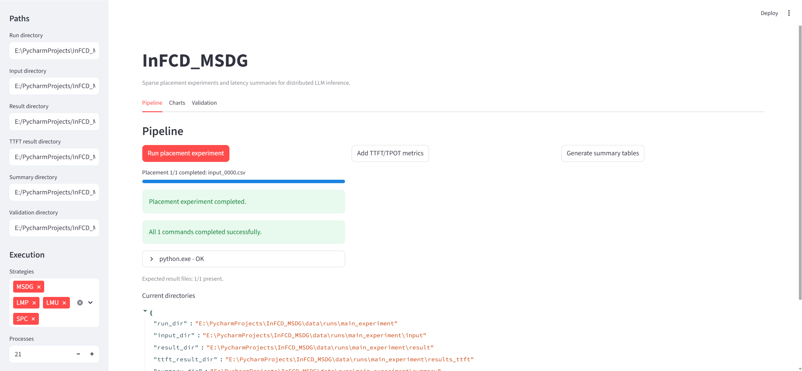
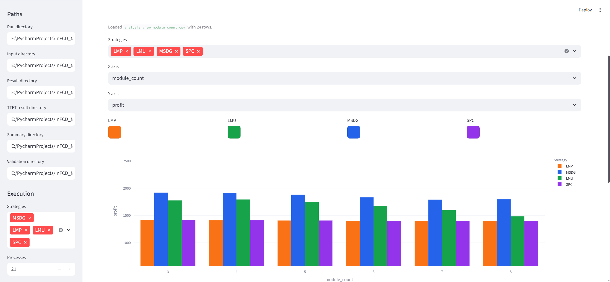
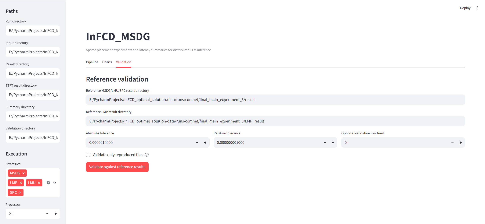

# InFCD_MSDG Visualization

This folder contains a local Streamlit dashboard for running InFCD_MSDG
experiments, generating TTFT/TPOT summaries, plotting grouped bar charts, and
checking reproduced results against a reference experiment.

## Start The App

From the repository root:

```bash
streamlit run visualization/app.py
```

The default run directory is:

```text
data/runs/optimal_solutions_compare_module
```

The app expects input CSV files under:

```text
data/runs/optimal_solutions_compare_module/input
```

The bundled example also includes `result/`, `results_ttft/`, and `summary/`
directories, so the Charts tab can be used immediately after startup.

## Strategies

The dashboard uses these display names:

- `MSDG` -> `multi_max_profit`
- `LMP` -> `lmp`
- `LMU` -> `multi_max_user`
- `SPC` -> `shortest_path`

## Workflow

1. Run placement experiments from the Pipeline tab.
2. Add TTFT/TPOT metrics from the Pipeline tab.
3. Generate summary tables from the Pipeline tab.
4. Open the Charts tab and select a summary table, x axis, y axis, strategy
   filters, and strategy colors.
5. Open the Validation tab to compare reproduced results with a reference run.

Long-running pipeline steps show progress in the app. Placement and TTFT/TPOT
generation report progress by CSV file, while summary generation and validation
report their current stage.

## Screenshots







For large experiment inputs, use multiple processes according to the available
CPU and memory budget. Large local inputs and generated results should stay out
of git unless they are intentionally curated examples.
